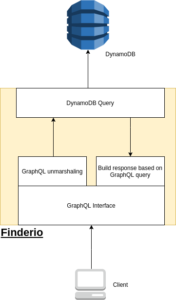
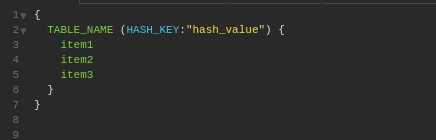

# Finderio

Finderio is a GraphQL interface server that connects to a DynamoDB database and fetches DynamoDB data based on GraphQL data.




The purpose is to help clients to fetch any data with little to no code.

## Setup

#### You will need: 

- Golang 1.14 version
- Docker
- Docker Compose
- AWS USER with DynamoDB read role

#### Dependencies:

The only dependency is the <b>Golang AWS SDK</b> for comunicating with DynamoDB

#### AWS User

For local setup, first you'll need to have a AWS user with DynamoDB READ role. (Higher roles work too but breaks the least priviledge principle).

The info you'll need from the AWS user is:

- Region of your DynamoDB 
- User ID
- User Secret

All the information needed is for the sole purpose of comunicating with the dynamoDB as a client as shown in this webpage:

https://docs.aws.amazon.com/sdk-for-go/v1/developer-guide/using-dynamodb-with-go-sdk.html
### Local Setup


With the information in hand add them as a enviroment variables: 

<b> Linux</b>
```
export FINDERIO_REGION={REGION} FINDERIO_ID={USER ID} FINDERIO_SECRET={USER SECRET}
```

<b> Windows </b>

```
I honestly don't know :(
```

After Env Variables are setup you should run:

```golang
go get -d -v //get dependencies
go build main.go //build source code
./main //run compiled source code
```

After that you should see something like this:

```
2021/06/13 20:16:41 Loading Env Var
2021/06/13 20:16:41 Starting sessions
2021/06/13 20:16:41 End of setup
2021/06/13 20:16:41 Server running on PORT: 8080
```

This mean finderio is up and running :)

### Docker Setup

For using finderio containerized you just need to setup the credentials in the `docker-compose.yml` file:

```yaml
version: "3.9"
services:
  finderio:
    environment:
      - FINDERIO_REGION=REGION
      - FINDERIO_ID=AWS USER ID
      - FINDERIO_SECRET=AWS USER SECRET
    build: .
    ports:
      - "8080:8080"
```

Then you only need to run: 

```
docker-compose up
```
Then something like this should be logged:

```
Building with native build. Learn about native build in Compose here: https://docs.docker.com/go/compose-native-build/
Recreating finderio_finderio_1 ... done
Attaching to finderio_finderio_1
finderio_1  | 2021/06/13 23:23:48 Loading Env Var
finderio_1  | 2021/06/13 23:23:48 Starting sessions
finderio_1  | 2021/06/13 23:23:48 End of setup
finderio_1  | 2021/06/13 23:23:48 Server running on PORT: 8080

```
For no logging in the terminal:

```
docker-compose up -d
```

## Usage

<b>IMPORTANT:</b>
As this moment, finderio only works queying <b>HASH KEY</b> and can only filter unnested data. <b> CAN ONLY QUERY ONE LINE PER REQUEST :(</B>

It is suggested to use Insomnia for querying, but feel free to use the graphQL client you want :)

For insomnia the query is as follows:



As the image shows, the query contains the DynamoDB table name, an hash key name with the hash key value wanted for query and the items wanted.


## To do


- Tests (seriously that are no tests.)
- Authenticated GRAPHQL query

<b>IMPORTANT:</b> Those two are extremely important and need to be fixed ASAP